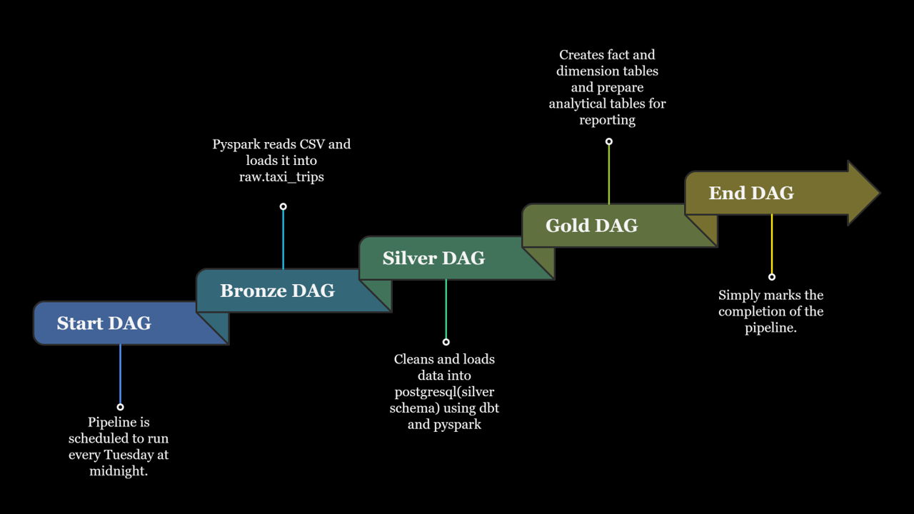

# NYC Taxi Data Engineering Pipeline

## What is this project?

This project is a data engineering pipeline built on the NYC Taxi dataset. This taxi trip data is ingested using PySpark, transformed through Bronze → Silver → Gold layers using dbt, orchestrated by Apache Airflow, and stored in PostgreSQL, and all running inside Docker containers.

## Tech Stack

<p>
  
  
  
  
</p>

PostgreSQL — the database where all layers are stored

Python — for DAG definitions and Spark

Docker — to run Airflow and PostgreSQL in containers

Apache Airflow — to automate and orchestrate the pipeline

Dbt — to transform and model the data with SQL

PySpark — to read the CSV and load data into PostgreSQL

## Pipeline Architecture

<p align = "center">

</p>


## How the pipeline works

First, the NYC Taxi CSV file is loaded into PostgreSQL using PySpark inside the Airflow ingestion task. This became the raw layer — also called the Bronze layer. The data at this stage is untouched, exactly as it came from the source.

After that, I used dbt to clean and transform the raw data. I filtered out bad rows like negative fares, zero distances, invalid timestamps, and trips outside NYC coordinates. I also added a trip_type column that categorizes each trip as short, medium or long, a trip_duration_minutes column calculated from the pickup and dropoff times, a time_of_day column that labels each trip as morning, afternoon, evening or night, and a pickup_location_id column that maps coordinates to one of 9 defined NYC zones. This became the Silver layer. After the models run, dbt tests check the data quality before moving on.

Then I created dimension tables and a fact table — this is the Gold layer. The dim_vendor table holds vendor names, dim_rate holds rate code descriptions, dim_locations maps zone IDs to coordinate boundaries, and fct_trips is the main fact table that connects everything together.

Finally I built the Mart layer which contains three aggregation tables. mart_monthly_summary shows the number of rides, average fare and average distance grouped by month, vendor and rate type. mart_payment_breakdown breaks down trips by payment method. mart_top_zones shows the top 5 pickup zones by trip count.

The hardest part of the whole project was automating all of these steps with Airflow. Getting the DAGs to run in the right order using Dataset-based dependencies and making everything work inside Docker took the most time and effort.


## Directory Structure
```
nyc-taxi-pipeline/
├── airflow/
│   └── dags/
│       ├── scripts/
│       │   └── transform_trips.py
│       ├── start_dag.py
│       ├── bronze_dag.py
│       ├── silver_dag.py
│       ├── gold_dag.py
│       └── end_dag.py
├── creating_schemas/
│   └── init_db.sql
├── data/
│   └── raw/
│       └── yellow_tripdata_sample_1000.csv
├── dbt/
│   └── taxi_pipeline/
│       ├── models/
│       │   ├── silver/
│       │   │   ├── stg_trips.sql
│       │   │   └── sources.yml
│       │   ├── gold/
│       │   │   ├── fct_trips.sql
│       │   │   └── dim_locations.sql
│       │   └── marts/
│       │       ├── mart_monthly_summary.sql
│       │       ├── mart_payment_breakdown.sql
│       │       └── mart_top_zones.sql
│       └── seeds/
│           ├── dim_vendor.csv
│           ├── dim_rate.csv
│           └── taxi_zones.csv
├── drivers/
├── dockerfile
├── docker-compose.yml
├── requirements.txt
└── .env
```


## dbt Models

### Silver
| Model | Description |
|-------|-------------|
| `stg_trips` | Cleans and casts raw taxi data, filters invalid rows, adds `trip_type`, `time_of_day`, `trip_duration_minutes`, and `pickup_location_id` |
| `stg_payments` | Stages payment-related data |

### Gold
| Model | Description |
|-------|-------------|
| `fct_trips` | Main fact table containing cleaned and enriched trip records |
| `dim_locations` | Maps coordinate ranges to 9 NYC pickup zones |
| `dim_vendor` | Vendor ID to vendor name mapping (loaded via seed) |
| `dim_rate` | Rate code ID to rate description mapping (loaded via seed) |

### Marts
| Model | Description |
|-------|-------------|
| `mart_monthly_summary` | Aggregates ride count, avg fare and avg distance by month, vendor and rate type |
| `mart_payment_breakdown` | Breaks down trips and revenue by payment method |
| `mart_top_zones` | Top 5 pickup zones by trip count with avg fare and distance |

### Seeds
| File | Description |
|------|-------------|
| `dim_vendor.csv` | Vendor ID to vendor name mapping |
| `dim_rate.csv` | Rate code ID to rate description mapping |
| `taxi_zones.csv` | NYC taxi zone reference data |


## How to run

**Requirements:** Docker, Docker Compose
```bash
# 1. Clone the repository
git clone https://github.com/rustam-amirov-1/nyc-taxi-pipeline-full.git
cd nyc-taxi-pipeline

# 2. Create .env file in the project root
DB_HOST=host_name
DB_PORT=5432
DB_NAME=db_name
DB_USER=user_name
DB_PASS=your_password

# 3. Start containers
docker-compose up --build -d

# 4. Create Airflow admin user
docker exec -it taxi_airflow_webserver airflow users create --username admin --password admin --firstname Admin --lastname User --role Admin --email admin@example.com

# 5. Open Airflow UI at http://localhost:8080
#    (credentials: admin_name / admin_password)

# 6. Trigger dag_start manually
```

The DAG handles everything from ingestion through to the mart layer automatically.


## Dataset

NYC Taxi 2015 dataset was used for this project.
You can download it from Kaggle:
https://www.kaggle.com/datasets/elemento/nyc-yellow-taxi-trip-data


## What I Learned

- How to build an end-to-end data pipeline from raw ingestion to analytical marts
- How to use PySpark inside an Airflow container to load data into PostgreSQL via JDBC
- How to structure dbt models across Bronze, Silver, Gold and Mart layers
- How to use Airflow Dataset-based dependencies to chain DAGs without direct triggers
- How to use `trigger_rule=ALL_DONE` and `ALL_SUCCESS` to control pipeline behavior on failures
- How to debug Docker container issues, environment variable problems, and JDBC connection errors
- How to write dbt tests to enforce data quality before moving to the next layer
- How to manage credentials securely using a `.env` file that is excluded from version control


